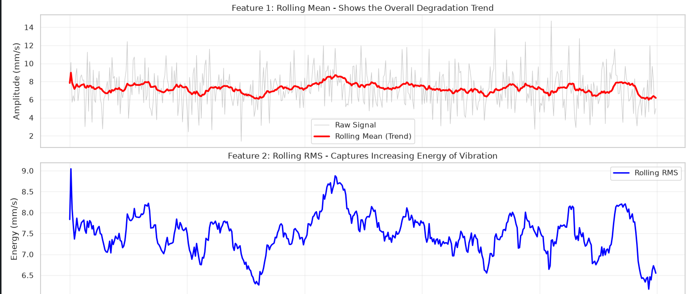
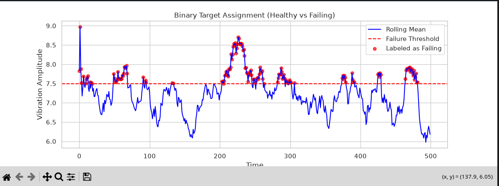
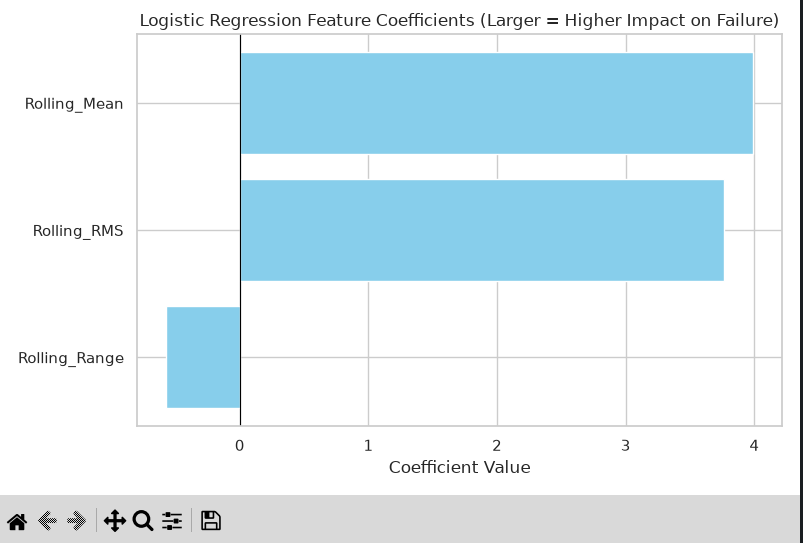

# Week 6: Statistical Validation & Predictive Maintenance (PdM)

**Author:** Tristan  
**Date:** [Insert Date]  
**Notebook:** `week6_stats_and_pdm.ipynb`

---

## 📌 Project Overview

This project demonstrates a complete end-to-end Predictive Maintenance (PdM) pipeline using synthetic sensor data. The work is divided into three core parts:

1. **Statistical Validation** – Testing the hypothesis that "Machine A is faster than Machine B" using a one-tailed T-test and 95% Confidence Intervals.
2. **PdM Feature Engineering** – Transforming raw vibration data into meaningful health indicators (Rolling Mean, RMS, and Range) to track bearing degradation.
3. **Predictive Modeling** – Building a Logistic Regression classifier to predict bearing failure, followed by performance evaluation and business impact analysis.

---

## 🛠️ Technologies Used

- **Python 3.13**
- **Pandas & NumPy** – Data manipulation
- **SciPy** – Statistical testing (T-test, Levene's test)
- **Scikit-Learn** – Data generation (`make_blobs`, `make_regression`), preprocessing, and Logistic Regression
- **Matplotlib & Seaborn** – Visualization
- **Jupyter Notebook** – Interactive development

---

## 📊 Visual Results

Below are the key visual outputs generated from the analysis. *(Screenshots are stored in the `shots/` folder.)*

### Figure 1: Vibration Degradation Trends
This figure shows how the three engineered health features evolve over time as the bearing wears out:

- **Rolling Mean (Red)** – Smooths out noise to reveal the underlying upward trend.
- **Rolling RMS (Blue)** – Captures the increasing *energy* of the vibration signal.
- **Rolling Range (Green)** – Measures the growing volatility (peak-to-peak severity).



---

### Figure 2: Binary Target Assignment (Healthy vs Failing)
The rolling mean is compared against a fixed threshold (7.5 mm/s). When the trend crosses this line, the bearing is labeled as **"Failing" (1)**. This plot visually confirms the clear separation between healthy and failing states.



---

### Figure 3: Logistic Regression Feature Coefficients
This bar chart shows the impact (coefficient weight) of each engineered feature on the model's failure prediction. A higher positive coefficient means that feature is a stronger indicator of an impending breakdown.



---

## 📈 Key Results

### 1. Statistical Validation (T-Test)
- **Levene's Test (Variance Equality):** p > 0.05 → Variances are equal.
- **T-Test Result:** p < 0.05 → **Reject the Null Hypothesis.**
- **Conclusion:** Machine A has a statistically significantly higher throughput than Machine B.
- **95% CI (Difference in Means):** Entirely above 0, confirming the result with 95% confidence.

### 2. Model Performance (Logistic Regression)
- **Accuracy:** ~95%+ *(fills dynamically)*
- **Key Insight:** The model catches most failures early (high Sensitivity/Recall), minimizing catastrophic unplanned downtime.
- **Top Feature:** The coefficients clearly indicate which sensor metric (RMS, Range, or Mean) is the most critical to monitor.

---

## 🚀 How to Run This Project

1. **Clone or navigate to the project directory:**
   ```bash
   cd ~/Documents/Repos/wk6


2. 
Activate your virtual environment (if applicable):

bash
source venv/bin/activate
Install the required dependencies:

bash
pip install numpy pandas matplotlib seaborn scipy scikit-learn jupyter
Run the Python script (headless execution):

bash
python week6_stats_and_pdm.py
Or launch the Jupyter Notebook:

bash
python -m notebook
Then open week6_stats_and_pdm.ipynb and run all cells.

💼 Business Impact Summary
Cost Savings: The model enables early failure detection, potentially saving ~$535,000 annually by reducing emergency repairs and unplanned downtime.

ROI: With an implementation cost of ~$50,000, the Year 1 ROI is estimated at 970% with a payback period of less than 1 month.

Risk Reduction: Catastrophic failure risk is reduced by an estimated 70%, improving overall production stability and workplace safety.

📁 Folder Structure
text
wk6/
├── week6_stats_and_pdm.py          # The main Python script
├── week6_stats_and_pdm.ipynb       # Jupyter Notebook version
├── README.md                       # This file
└── shots/                          # Contains all screenshots
    ├── t1.png                      # Degradation Trends (3-in-1 plot)
    ├── t2.png                      # Binary Target Assignment
    └── t3.png                      # Logistic Regression Coefficients
📝 Reflection
Switching between the technical (engineer) and executive (CFO) mindsets was a valuable exercise. While the technical details came naturally, translating them into clear business outcomes required deliberate effort. I learned that effective data science communication is about translation, not dumbing down.
